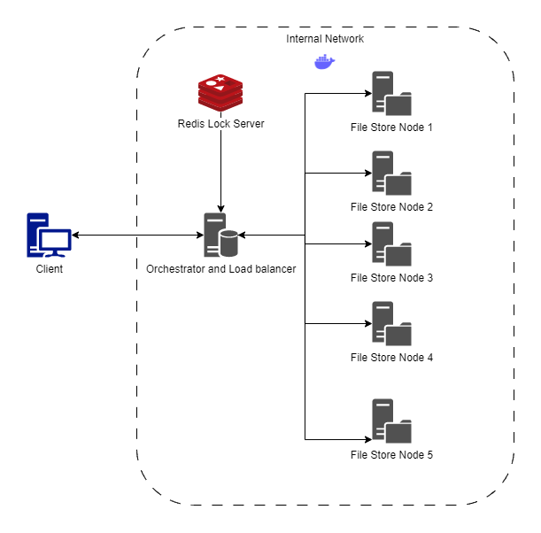
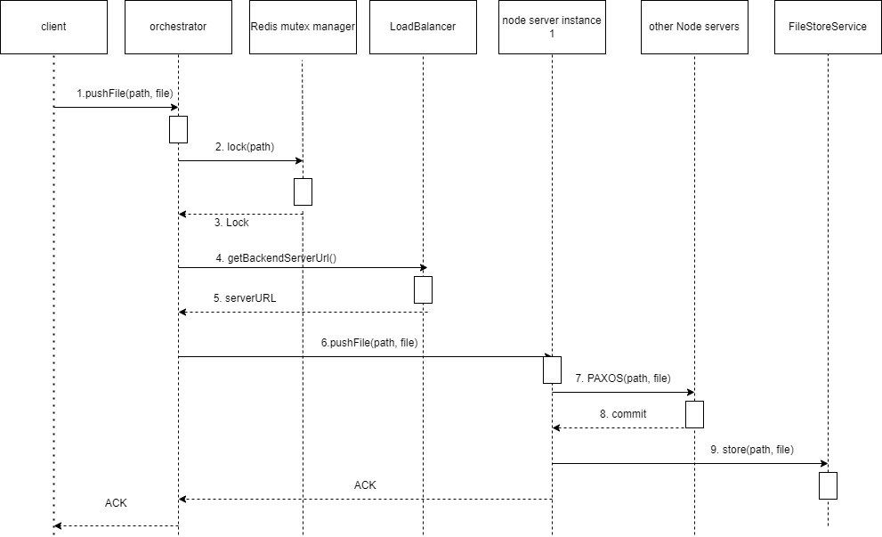

# **CS6650: Distributed Cloud Storage System**

**Team**: Divyanshu Sharma  |  Tanmay Gadgil  |  Pavan Sai Gurudu

[Jump to usage](#usage-and-operation)

## **Introduction**

In this project, we aimed to create a distributed file storage service that can be run on the cloud. Clients can interact with this service via a command line interface and should be able to work with directories and upload/download files. A list of features supported by this application includes:

* Terminal-based user interaction
* Folder browsing and navigation
* Folder creation and deletion
* File upload and deletion
* File download
* File synchronization across all node servers

Along with these features, we also aim to satisfy the following criteria necessary for a good distributed system:

* Consistency: We want to be able to get any file and have a consistent state regardless of which node we access.
* Scalability: We should be able to add new servers that perform the same functionality to provide scalability
* Performance: Multiple replicas allow users to access any consistent copy of the data instantly
* Availability: High replication ensures that even if a single service goes down, we can use other servers to serve clients

## **Methods / Algorithms**

In this project, we have made use of the following distributed algorithms and concepts

### **Mutex**

Mutual exclusion is a critical concept in distributed systems. We achieve mutex in our project by using a Redis database as a locking service that enables us to run replication algorithms between nodes.

Some of the features of using Redis include

* Minimizing deadlocks since the TTL service Automatically releases locks after a timeout is reached
* Efficient and fast caching
* The ability to centralize our locks so that servers need not rely on working with threads

### **PAXOS**

Paxos is a consensus algorithm used in distributed systems to achieve agreement among a group of nodes on a single value or a set of values. It is designed to work in asynchronous and unreliable network environments and provides safety and liveness guarantees.

In the context of our project, Paxos can be used to ensure that all nodes in the system agree on the state of the file storage service. For example, when a client uploads a file, the state of the file storage system should be updated on all nodes to maintain consistency. Paxos can be used to reach an agreement on the order in which the updates are applied to the system, ensuring that all nodes have the same view of the state.

Paxos can also help with availability and fault tolerance by allowing the system to continue functioning even if some nodes fail or become unavailable. If a node fails, the other nodes can continue to operate and reach an agreement on updates to the system, ensuring that the service remains available to clients.

### **Peer-to-Peer Networks**

Implementing Paxos without a central server enables a peer-to-peer network architecture, where all nodes in the system have equal capabilities and responsibilities. In this project, each node is responsible for maintaining and updating its own state, as well as participating in the Paxos consensus protocol to reach an agreement with other nodes.

By removing the central server, the system becomes more resilient and fault-tolerant, since there is no single point of failure. Each node can continue to operate and participate in the consensus protocol even if other nodes fail or become unavailable. This can help to ensure that the system remains available and responsive to clients even in the face of network disruptions or other failures.

A peer-to-peer network also allows for more flexible scaling and distribution of resources, since nodes can be added or removed from the network dynamically as needed. This can help to ensure that the system can handle changes in workload or usage patterns without becoming overloaded or unresponsive.

### **Replicated Data Management**

By replicating data across multiple nodes, the system becomes more fault-tolerant and resilient to failures. If one node fails, the other replicas can continue to operate and serve client requests. Additionally, clients can access any replica of the data, which can help to improve performance and reduce latency.

Paxos can help to ensure that updates to the replicated data are propagated to all replicas in a consistent and reliable manner. When a client updates the data, the update is proposed to the Paxos protocol and eventually agreed upon by all replicas. This helps to ensure that all replicas have the same view of the data, and that clients can access the latest version of the data regardless of which replica they access.

## **Implementation**

### **Architecture**

Our Architecture consists of a Client, Orchestrator, and node servers along with a redis db for the locking mechanism

### **Components**

#### Client

This component is the user interface for our application. The client provides a command line interface for a user to interact with the distributed cloud storage system.

Because files need to be transferred from the client to the central server, as well as requests to browse, delete, download, and upload files, HTTP will be used in this part. We make use of  The Apache HTTP Client library to take advantage of certain features:

* Supports synchronous and asynchronous requests.
* Compression. Apache HTTP client supports GZip and Deflate compression methods. File compression can increase the throughput of our file system.
* Caching. Caching is supported in the Apache ATTP client. Caching will decrease the number of requests needed, thus decreasing the workload of the whole system

#### Orchestrator

This component acts as the point of communication for the client and also as a load balancer that distributed requests to the node servers. Some o the features of this component are:

* Listen to requests from clients. For GET requests, the central server evenly distributes them to other servers, and the server that received this request would send the data to the client. For requests that modify existing data, it uses Redis to lock the file and use PAXOS to propose this file to all node servers for consistency.
* Forward request to the node server. The central server can forward the request to node servers using an HTTP request. The actual work is done in different node servers so that the system is highly scalable and the throughput is increased.
* Manage servers. The central server can add and remove other servers. If a server is determined to be down, it will be removed from the system and stop distributing requests to it.
* Log system information. The central server would log the state of the whole system and for each server, it can also record the requests received.

#### Node

This is the main computational unit of our application. It is responsible for storing its own version of all replicated files and ensuring that it is consistent with other nodes in the node group. Some of its features include:

* Communicate with the orchestrator to send/received data.
* Store and manipulate files to and act as a replicated data store.
* Achieve consensus by running Paxos when an appropriate client request comes in

### **Communication and Web Service Architecture**

We use the REST architecture to communicate between the client and orchestrator and in between nodes. To spin up a service that can help us write the necessary APIs, we make use of Springboot. Spring Boot is a popular framework for building web applications in Java. It provides a range of features and tools to simplify the development process, such as embedded servers, auto-configuration, and dependency management. With Spring Boot, developers can quickly create scalable, production-ready applications with minimal boilerplate code.

Some of the APIs defined for our system include:

Directories: /directories?path=&lt;dirpath>

* GET: Retrieve all files and directories in a folder
* POST: Create a folder by its path
* DELETE: Remove a folder by its pat

Files: /files?path=&lt;filepath>

* GET: Access a file by its path
* POST: Upload a file by its path (file added to a multipart form)
* DELETE: Remove a file by its path

### **Typical Workflow**

The diagram shows a typical sequence diagram for a request to push a file to the file system.

The diagram for getting a file and other functionalities is also quite similar, just with different API calls and service method calls.

The orchestrator decides which node server gets the request, and locks the resource being accessed. Then the first node server that receives the request acts as the proposer for the Paxos algorithm. If Paxos is successful all node servers save the file otherwise the error is returned to the user. If two clients simultaneously try to access a resource, as expected the Redis-based lock prevents this.

## **Usage and Operation**

A user can interact with our service using the client package.

#### Running the commands

We can run the service by doing the following steps:

* Servers and Orchestrator: In the base folder path run the following command:
    * `docker-compose up --build`
* Client: to run the client you will need to run a jar file
    * Navigate to the client folder
    * Run the command: `java -jar client.jar (userName)`
        * (userName): Name of the current user.

#### Supported Commands

* Get-ChildItem - Lists all the files in a location
* Set-Location &lt;path> -  Changes directory to a particular location
* New-Directory &lt;path> - Creates a new director
* Remove-Directory &lt;path> - Deletes a directory
* Remove-File &lt;path> - Deletes a file
* Get-Location - Gets the current working directory
* Get-File &lt;path>- Gets a file from the server
* Push-File &lt;localpath>- Uploads a file to the server
* Exit - exits the application

## Results

We were successfully able to deploy an application that ran on a docker network.

Our application was able to

1. Upload and download files
2. Create and delete directories
3. Delete files
4. Replicate the files between each server

More information on the functionality and use can be found in our demo video

## **Conclusion**

In conclusion, the experience of implementing this project as a student was very rewarding. We learned a lot about distributed systems, cloud computing, and command line interfaces and tools like REDIS, Springboot, and REST APIs in general. We also had the opportunity to work with a team of talented students, which was a great learning experience.

One of the most challenging aspects of the project was ensuring that the system was consistent. We had to implement a version of PAXOS to ensure that all of the nodes had the same view of the data. Another challenge was ensuring that the system was scalable. We had to design the system in a way that it could be easily expanded to add new nodes.

Despite the challenges, we were able to successfully implement a distributed file storage service that meets all of the requirements. The system is consistent, scalable, and performant. It is also available, even if a single node goes down.

## Future Extension / Work

This is a very basic application and has a lot of scope for expansion. Some of the features that we can add to this are:

1. Dynamic Addition and deletion of servers
2. Multiple orchestrators to handle more client traffic
3. More commands like preview and crawling
4. A GUI to see all possible files in one go
5. Hosting on a cloud VM or servers
